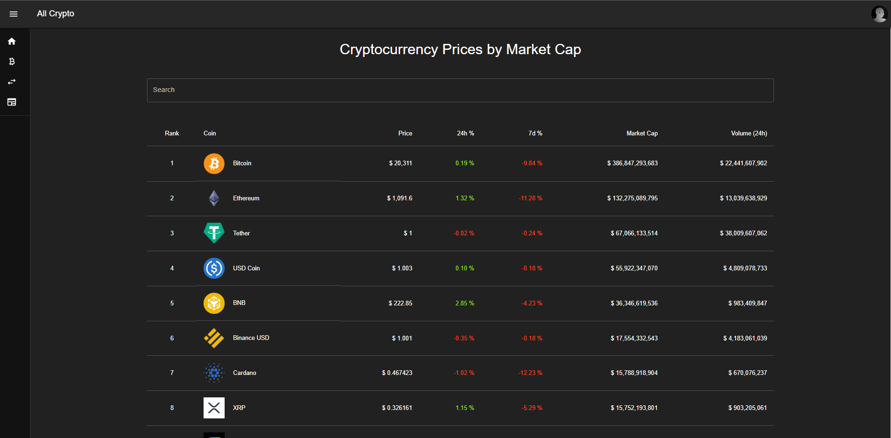

In this blog, I will share how I created my my own React website which extracts and display informative cryptocurrency API data.

If there is any information that is unclear in this blog, you can refer to my [Github repository](https://github.com/aloysiustanrs/all-crypto-react-website) of this project

# Material UI (MUI)

## Why do I use MUI ?

Material UI is an open-source React component library by Google.

I use Material UI because it has beautiful prebuilt components. They also have components functionalities which would be troublesome to create from scratch.

## How to use MUI ?

```
npm install @mui/material @emotion/react @emotion/styled
```

I learnt how to use MUI by reading the documentation and trying it out and playing around with the code. There are also alot of youtube videos on how to use MUI on youtube [Material UI Tutorial by The Net Ninja](https://www.youtube.com/playlist?list=PL4cUxeGkcC9gjxLvV4VEkZ6H6H4yWuS58)

Creating the Homepage

## CoinGecko API

CoinGecko is the world’s largest independent source of reliable cryptocurrency data.

Their API is 100% free, is publicly available and does not require fees and the free plan has a rate limit of 50 calls/minute which is more than enough for this personal project.

Using this API, I will be able to access free cryptocurrency data to display on my website

## GNews API

GNews is a simple API to search and collect news and blog articles.

I will be using the free plan which has up to 100 requests per day which will be sufficient enough for this personal project.

Unfortunately, only up to 10 articles will be returned per request, but it does not matter as I will still be able to create the news page with 10 articles.

# Pages

## Home Page

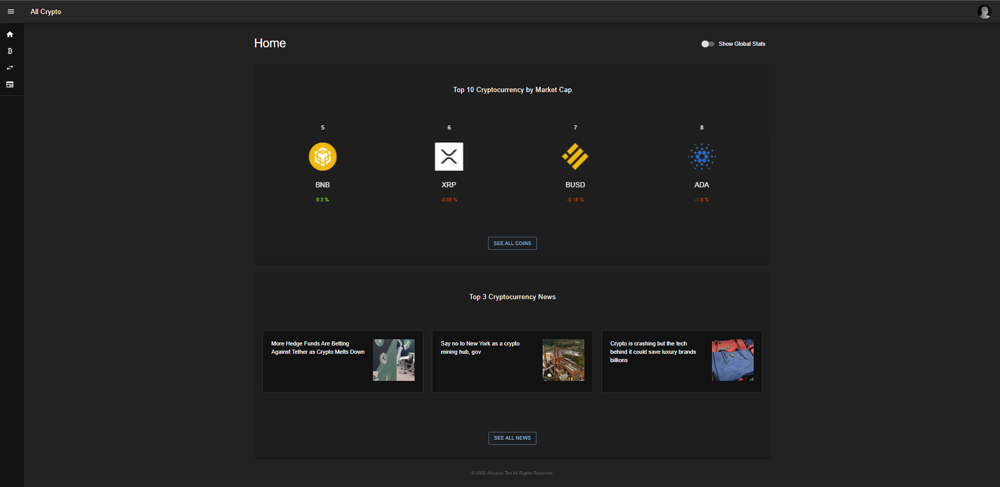

The first page show when the website is loaded is the homepage.

The homepage is basically a summary of :

1. Global Stats of cryptocurrency markets
2. Top 10 Cryptocurrency coins by their market cap\*
3. Top 3 Cryptocurrency news

Added the top 10 coins into a AliceCarousel so that they are moving every second and it looks aesthetically pleasing 😄

## Coin List Page

Created using MUI's table component so that I can display the coins according to market cap showing their : Price, Market Cap, 24h % Change, 7d % Change and 24h Volume.

## Exchanges Page

Created using MUI's table component to show list of exchanges and their rankings based on trust score, followed by 24h Volume.

## News Page

Created using MUI's card component to display the latest cryptocurrency articles.

Before mapping the data onto the page, the data are filtered according to some variable (eg. name and symbol for the coin list) by the input entered into the search bar.

Then, the filtered data is sliced to make the pagination component work for each page to display only 10 results.

## Coin Page

### Coin Data

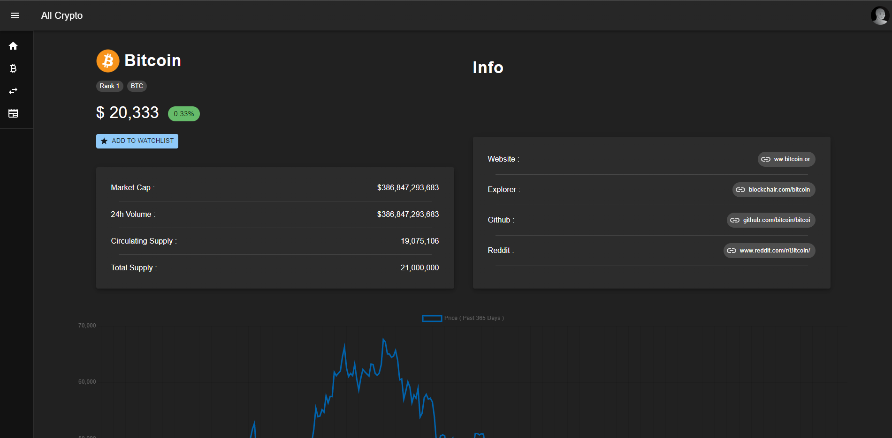

Under the coin data section, I have included important information on the coin such as the coin's data and their socials which was easily done by scraping from the individual coin data endpoint.

### Coin Chart


```
npm install react-chartjs-2 chart.js
```

After installing the packages for the chart, I retreived data from the historical data endpoint.

Depending on which toggle button is selected, the historical data will be searched based on the time period selected.

For example, if '1 year' is selected, historical data from 1 year back to now will be fetched and displayed on the chart.

I used a line chart as is an appropriate chart type to display cryptocurrency prices.

# Firebase

## What is Firebase?

Firebase is a Google-backed application development software that enables developers to develop iOS, Android and Web apps.

I will use Firebase to authenticate my users and also create a database for them to save their favourite coins to add to their personal watchlist.

First I installed firebase using NPM, then under project settings, there will be the code for our SDK setup and configuration.

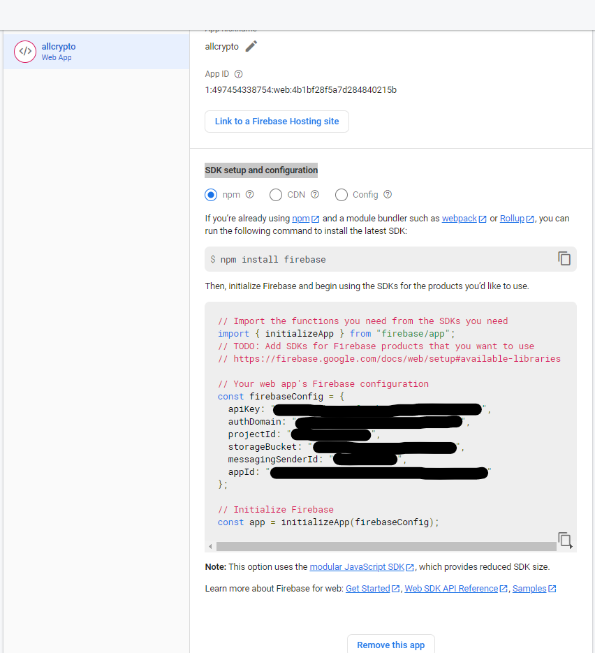

Add the code into a firebase-config.js file + the two lines of code below

```
    export const auth = getAuth(app);
    export const db = getFirestore(app);
```

## Firebase Authentication

When the user first opens the page, he is not logged in and 'LOGIN' button will be displayed on the top-right corner.

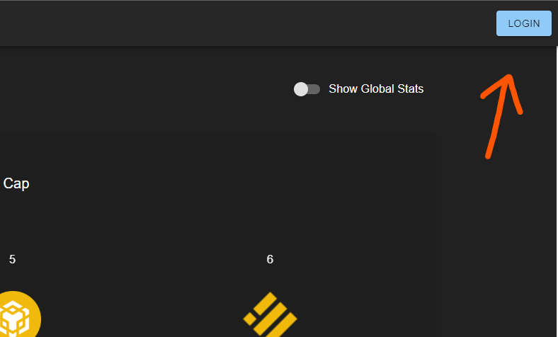

After clicking the 'LOGIN' button, a pop up will be shown for the user to login using email and password or sign in with Gmail.

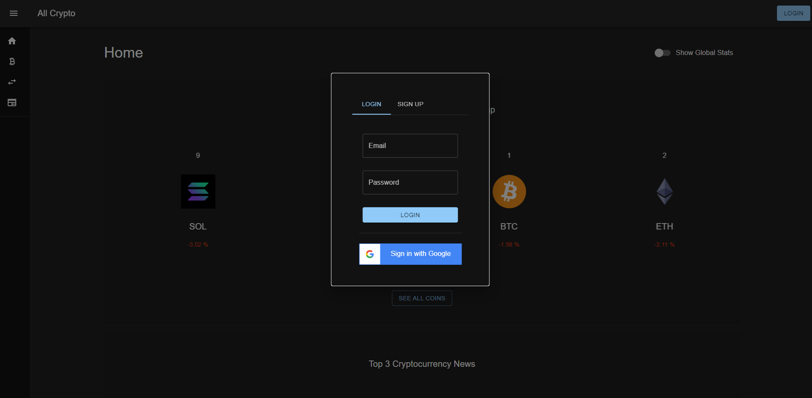

This was done using [Firebase Authentication](https://firebase.google.com/docs/auth/web/start)

The image below show the list of users that are authenticated on the website.

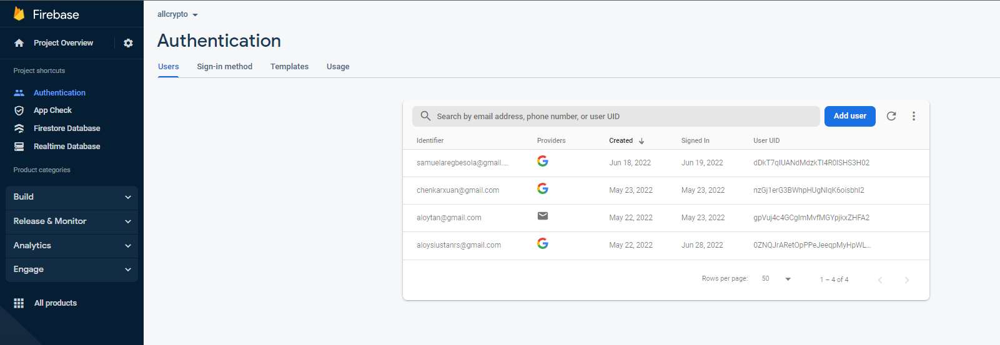

## Firestore Database

In order to create a watchlist for our users as shown below , I used Firestore database to store each user's watchlist which is tied to their 'User UID'

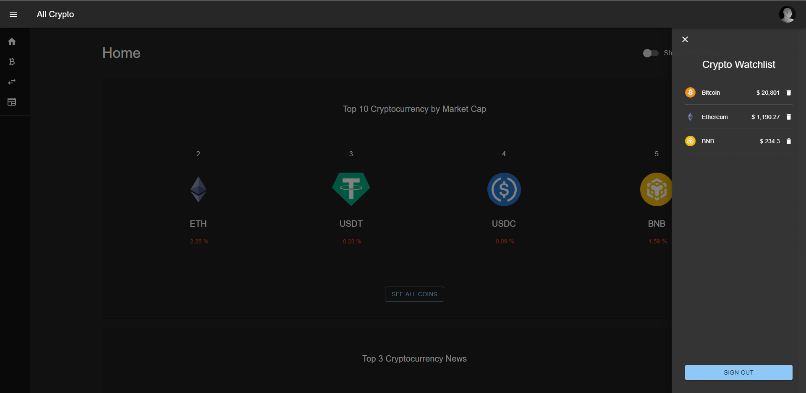

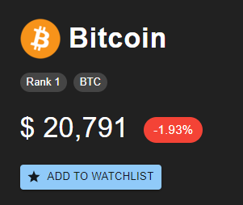
Add coin to watchlist
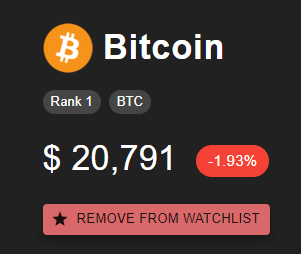
Remove coin from watchlist
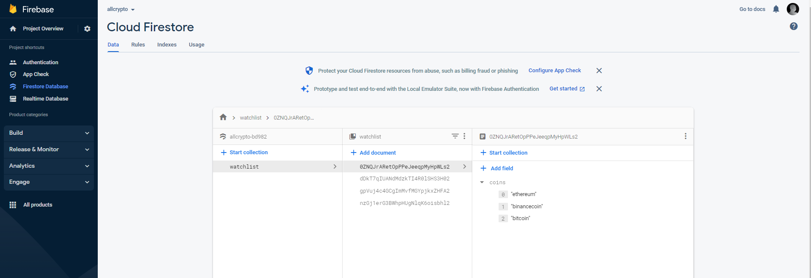
The image above shows the users and the coins in their watchlist.

# Conclusion

- Learn a new React component library : Material UI

- Got more comfortable and improved in using React

- Learnt how to use the UseContext hook to manage state more easily in my project

- Learnt how to manage state more comfortably with UseState & UseEffect hook

- Learnt what is Firebase and how to use its authentication and database
