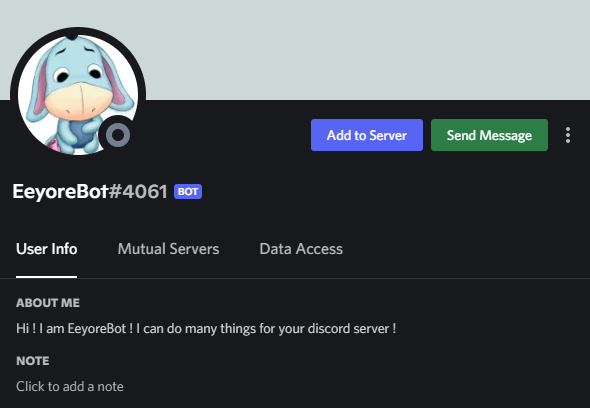

In this blog, I will share how I created my my own discord bot using discord.py which is a API wrapper for Discord so that I can create the discord API more easily with Python.

If there is any information that is unclear in this blog, you can refer to my [Github repository](https://github.com/aloysiustanrs/)

# Why am I creating a discord bot?

1. Practice my python skills

2. Create a bot which has customised features

3. I can name the bot whatever I want 😊

# How to create discord bot?

Use this [link](https://discord.com/developers/applications) and create a new application

- Go to 'Bot' tab and create a new bot, enabling all 'Privileged Gateway Intents'

- Go to 'OAuth2' tab > General: Select the 'In-app Authorization' > Scopes: Select 'bot' & 'applications.commands' > Bot Permissions: Administrator

- Go to 'OAuth2' tab > URL Generator > Scopes: Select 'bot' > Copy link and paste onto browser > Add the bot to your discord channel

# Bot Features

1. Anime recommendation

2. Clear Messages

3. Play music with queue

I will explain how I implement these features with the bot below.

In order to code the bot, I will be using the [discord.py](https://discordpy.readthedocs.io/en/latest/) so that it is easier to code out the discord bot in Python

# Feature 1 : Anime recommendation

## Why this feature?

I have a discord channel with my friends and we like to watch anime. However, as a long time anime fan, I have already watched alot of anime.

Therefore, I thought of adding a feature to the discord bot where with one command, I can have a random anime recommended to me with all its details and I might consider watching it.

## Code

```python
import requests
import discord
from discord.ext import commands

# Get random anime data from endpoint
def respond():

    random_anime = requests.get('https://api.jikan.moe/v4/random/anime').json()['data']


    image =  random_anime['images']['jpg']['image_url']
    title = random_anime['title']
    description = random_anime['synopsis'] if random_anime['synopsis'] else '-'
    episodes = random_anime['episodes']
    all_genres = [genre['name'] for genre in random_anime['genres']] + [genre['name'] for genre in random_anime['explicit_genres']]
    all_genres = ', '.join(all_genres) if all_genres else '-'
    studios = ', '.join([studio['name'] for studio in random_anime['studios']]) if random_anime['studios'] else '-'
    duration = random_anime['duration']
    link = random_anime['url']

    ret = f"Title: {title} \n\nDescription: {description} \n\nEpisodes: {episodes} \n\nGenres: {all_genres} \n\nStudio: {studios} \n\nDuration: {duration} \n\nLink: {link} \n\n{image} "

    return(ret)

# For commands
class Anime(commands.Cog):
    def __init__(self, bot):
        self.bot = bot

    @ commands.command()
    async def anime(self, ctx):
        """Recommends random anime"""
        recommendation = respond()
        await ctx.send(recommendation)

```

In order to obtain anime recommendations, I used the Jikan API which is an open-source API with anime data :

- Used the requests which extracts the JSON data from the random anime API endpoint.

- Extract important details of the random anime(image, title, description, etc.) into their variables.

- Combine variables into a string and return nicely

## Results

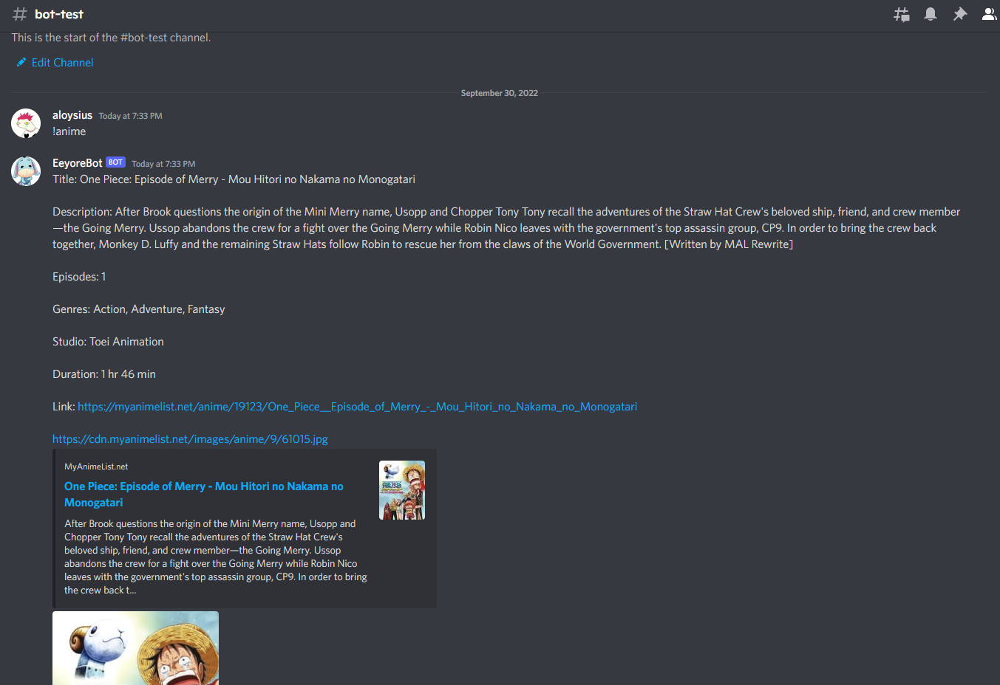

After calling the '!anime' command, the bot replies with a 'One Piece' movie recommendation. Cool!

# Feature 2 : Clear Messages

## Why this feature?

Sometimes, a discord channel become too messy with alot of messages.

However there is no function to clear alot of messages at a time in discord. So I can only delete messages one at a time.

Therefore, this feature allows us to delete many messages with just a command.

## Code

````python
from discord.ext import commands
import asyncio


class Admin(commands.Cog):
    def __init__(self, bot):
        self.bot = bot

    @ commands.command()
    async def delete(self, ctx, number=10):
        """Delete text in text channel"""

        await ctx.channel.send(f'Type \'yes\' if you want to delete {number} messages')

        try:
            res = await ctx.bot.wait_for(
                "message",
                check=lambda x: x.channel.id == ctx.channel.id
                and ctx.author.id == x.author.id,

            )

            if res.content.lower() == "yes":
                deleted = await ctx.channel.purge(limit=number)
                await ctx.channel.send(f'Deleted {len(deleted)} message(s)')
                return

        except asyncio.TimeoutError:
            await ctx.channel.send('Time out! Request cancelled')
        else:
            await ctx.channel.send('Request cancelled')

    @ commands.command()
    async def commands(self, ctx):
        """Shows list of commands"""
        commands_string = '\nAnime\n\n!anime - Recommend random anime\n-----\nMusic\n\n!play <youtube url> - Play song\n!queue <youtube url> - Queue Song\n!showqueue - Show list of songs queued\n!clearqueue - Clear all songs in the queue\n!skip - Skip current song\n!pause - Pause current song\n!resume - Resume current song\n!stop - Stop all songs and disconnect bot from voice channel\n-----\nClear messages\n\n!delete <number(optional)>'
        await ctx.send(f'```{commands_string}```')
````

In order to organise code, I created a 'Admin' Cog, which basically groups commands under a class.

After typing '!delete' command, the bot will ask 'Type 'yes' of you are sure' to prevent any accidental deletion.

Using discord.py's bot.wait_for function, the bot will wait for a message from the same channel and from the same person that called the command.

| Repsonse                       | Result                                                                                                    |
| ------------------------------ | --------------------------------------------------------------------------------------------------------- |
| _No messages_ within 5 seconds | x number of messages ('limit' number in code) will be deleted using discord.py's channel.purge() function |
| No messages within 5 seconds   | 'Time out! Request cancelled'                                                                             |
| Message not 'yes               | 'Request cancelled'                                                                                       |

## Results

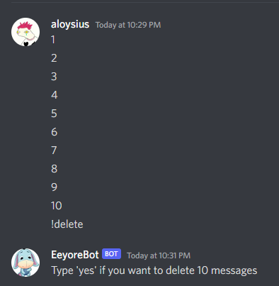
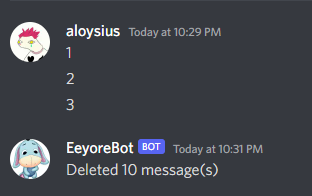

Default '!delete' &rarr; 10 messages deleted (includes texts for confirmation)

---


'!delete x' &rarr; x messages deleted

---

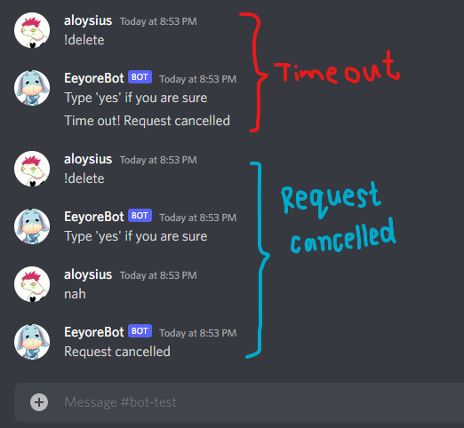

No message sent within 5 seconds &rarr; 'Timeout! Request cancelled'

Any message that is not 'yes' &rarr; 'Request cancelled'

# Feature 3 : Play music with queue

## Why this feature?

I want to be able to play music in a discord voice channel.

On top of that I want to be able to queue a long list of songs and be able to edit that list.

## Prerequisites

- Install [PyNaCl](https://pypi.org/project/PyNaCl/)
- Add [FFMPEG](https://ffmpeg.org/) to Windows path using Environment variables by following this guide

## Code

I used audio extraction code from [YTDL library](https://github.com/Rapptz/discord.py/blob/master/examples/basic_voice.py)

I will only be going through the functions and commands I coded for the bot, the rest of the code can be found in my github repository.

```python
class Music(commands.Cog):
    def __init__(self, bot):
        self.bot = bot
        self.queue = {}

    def check_queue(self, ctx, id):
        if self.queue[id] != []:
            source = self.queue[id].pop(0)[0]
            ctx.voice_client.play(
                source, after=lambda x=0: self.check_queue(ctx, ctx.message.guild.id))

# Exclude YTDL library and command codes
```

Before writing the commands, I created a class variable 'queue' as a hash map which tracks the list of songs queued.

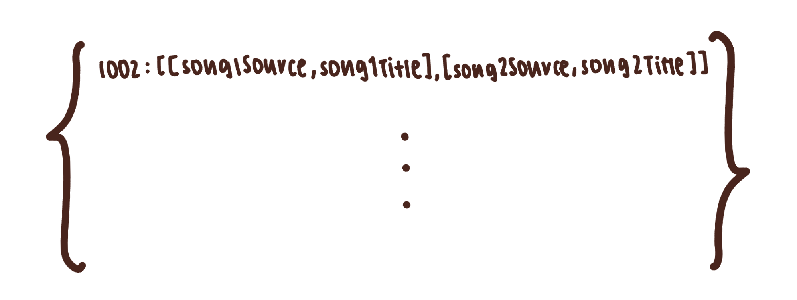
This is a visual representation the songs data in the queue hash map.

Eg. In voice channel server 1002, song1 is next in queue followed by song2. Both songs have their array data containing their source and title.

I also created a check-queue() function which :

- Check if theres any song in the queue
- If there is, play song in top of queue and remove it
- After songs ends , call function again recursively to check if there is song in queue to play

## Other music commands

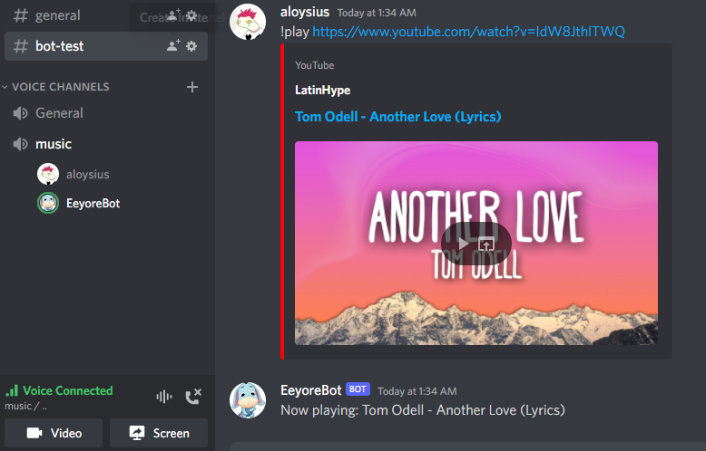
'!play' command

---


'!queue' command

---

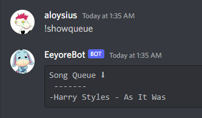
'!showqueue' command

---

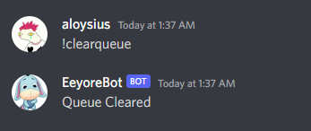
'!clearqueue' command

---

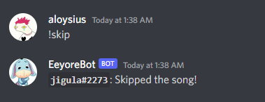
'!skip' command

---

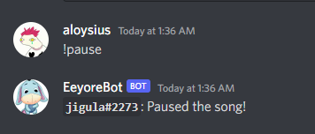
'!pause' command

---

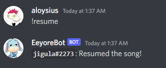
'!resume' command

---

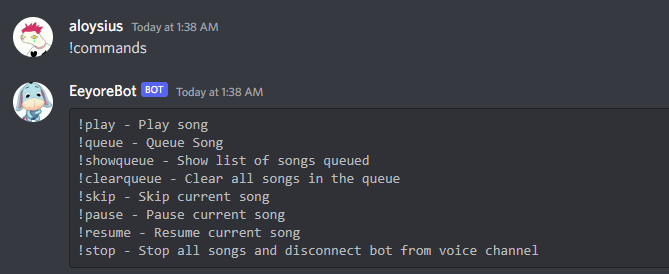
'!commands' command

---

# Conclusions

What I learnt?

- How to scrap data from API and use the JSON data effectively
- Learnt discord.py API to create the bot
- Learn more about Object-Oriented Programming (OOP) in Python and got more comfortable in using classes.
- Improved on reading documentation of APIs to figure out how to code up the bot
