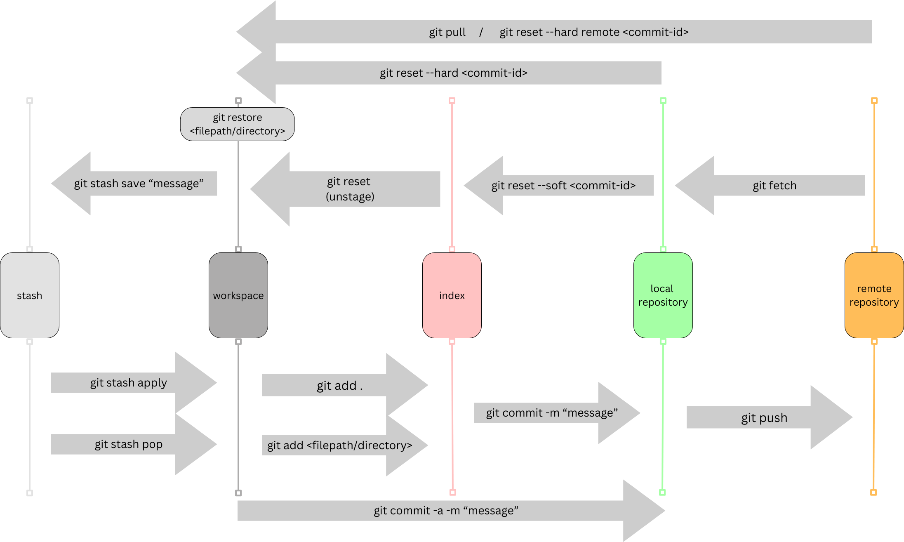
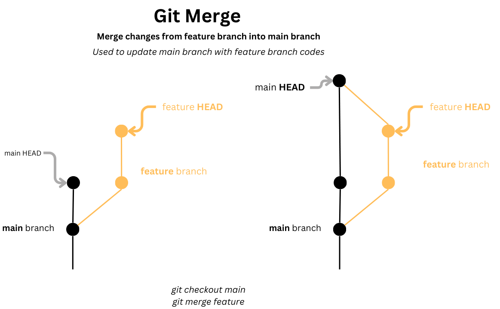
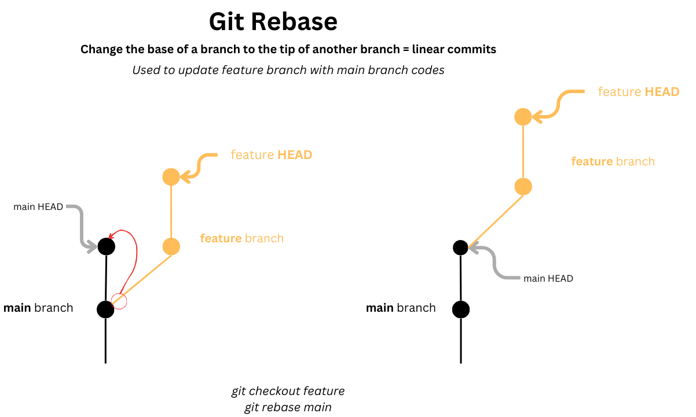

Knowing how to use Git as a developer is a crucial skill. Without a strong understanding of Git commands, it becomes challenging to effectively manage and collaborate on software projects.

# How git works



# List of common git commands

```bash
# see all git configs
git config --global --list
git config --global user.name "YourGitHubUsername"
git config --global user.email "youremail@example.com"

# initialise local git repo
git init

# stage all changes to index/cache
git add .
# stage one file
git add file/path
# stage interactively
git add -i

# commit staged changes on local repo
git commit -m "commit message"
git commit --amend -m "ammended message for commit"

# see status
git status
# see short status
git status -s

# see git history of commits
git log
# see file changes for commits
git log -p
# see log for all branches
git log [--oneline][--all][--graph]

# undo changes in file back to previous commit
git restore <filepath/directory>
# unstage but keep changes
git restore --staged <filepath/directory>


# create new commit that undo previous commit changes
git revert commit-id

# reset HEAD in current branch to a specific commit , used to "uncommit" changes
# Soft reset: reset to commit id, keeps changes staged and in working directory
git reset --soft commit-id
# Mixed reset: reset to commit id, unstages changes but keep in working directory
git reset commit-id
# Hard reset : reset to commit id, discards changes both in staging and working directory
git reset --hard commit-id


# save stash without message
git stash
# save stash with message
git stash save "Stash message"
# see stash list
git stash list
# show changes for stash
git stash show
# use latest stash and remove
git stash pop
# use latest stash but don't remove
git stash apply


# see branch details
git branch
git branch -v
git branch -vv
# rename branch
git branch -m old-branch-name new-branch-name
# set branch upstream (set local branch main to track remote origin/main)
git branch --set-upstream-to=origin/main main

# checkout to branch
git checkout branch
# checkout to a specific commit-id with "detached HEAD" state = HEAD not associated to any branch
git checkout commit-id

git push --set-upstream origin DogFeatures

# merge branch into current branch (might have to resolve conflicts)
git merge branch

# rebase
git rebase commit-id/HEAD~n
# rebase interactively (can pick & squash commits)
git rebase -i commit-id/HEAD~n

```

# Git merge and rebase

## Git merge command



## Git rebase command



## When to use merge vs rebase?

|        |                          When to use ?                           |
| :----: | :--------------------------------------------------------------: |
| Merge  |      Use to add changes from feature branch to main branch       |
| Rebase | Use to re-anchor feature branch to keep updated with main branch |

> Git is like a time machine for your code, allowing you to revisit the past, collaborate in the present, and plan for the future.
