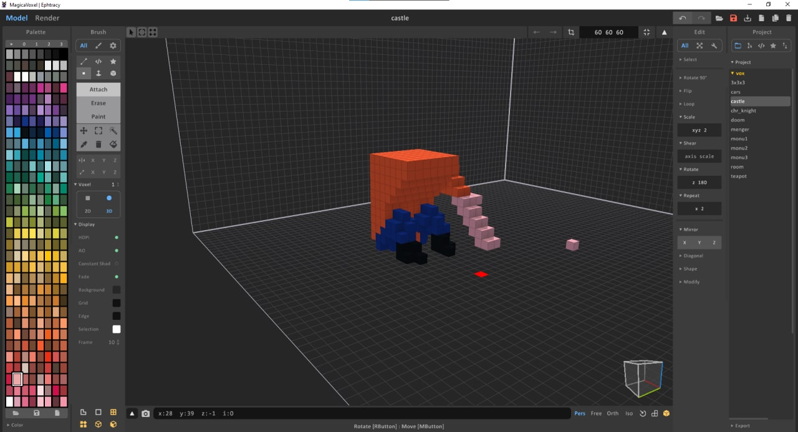
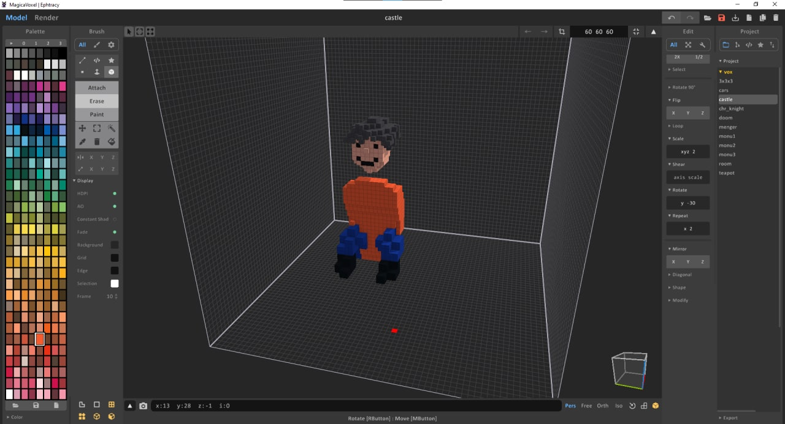
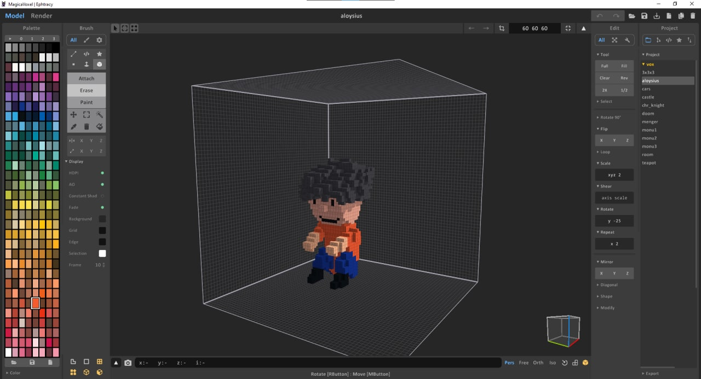
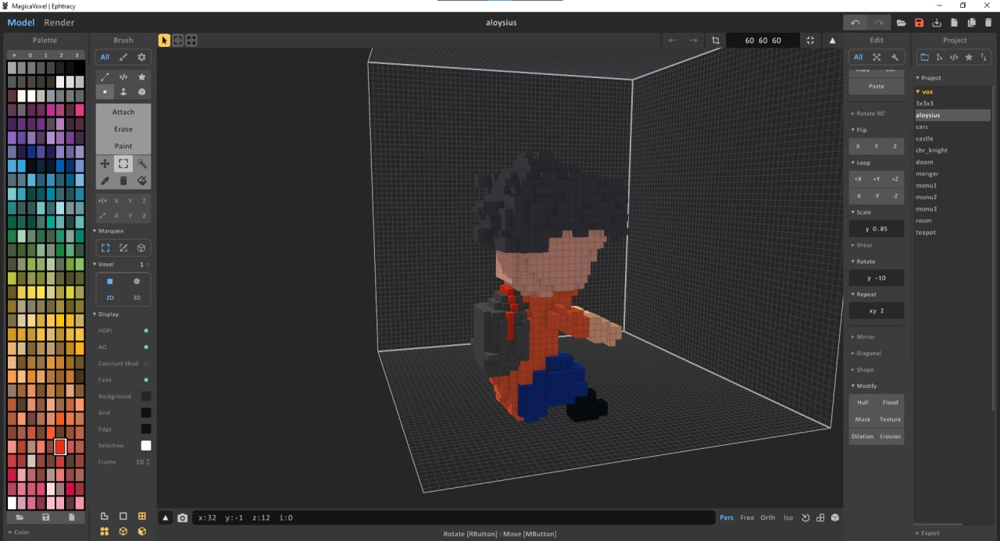
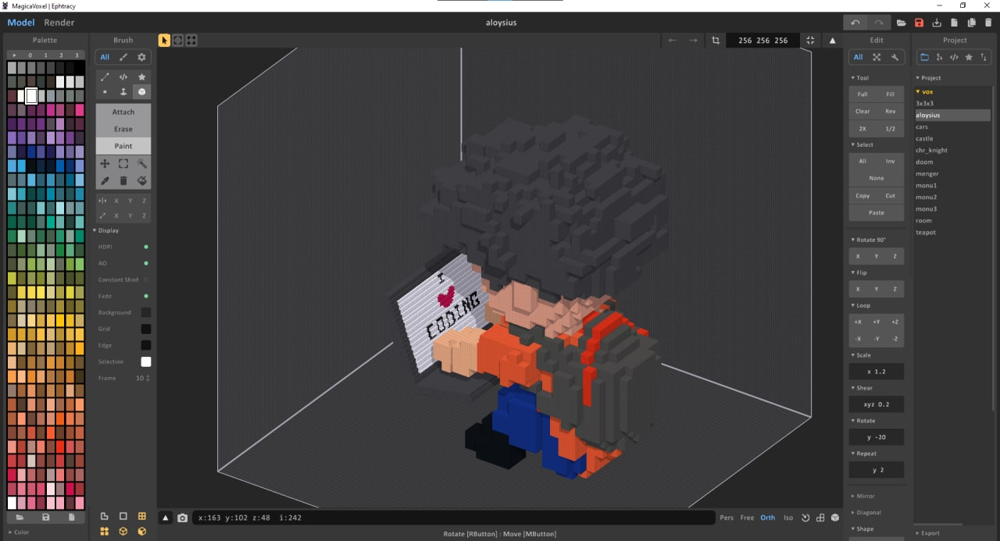
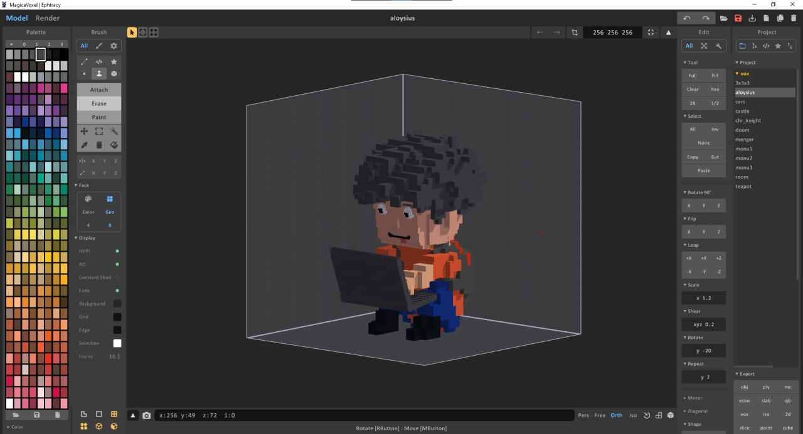
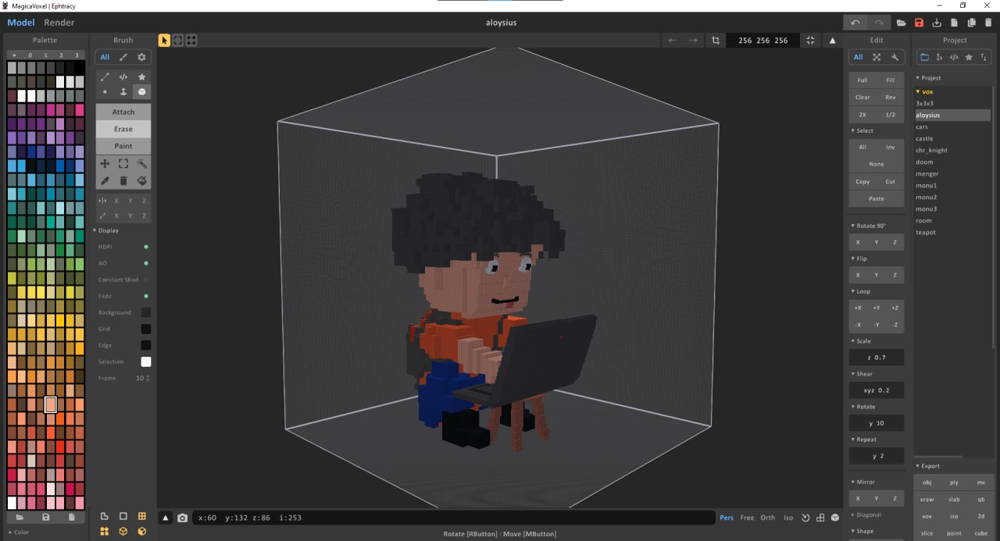
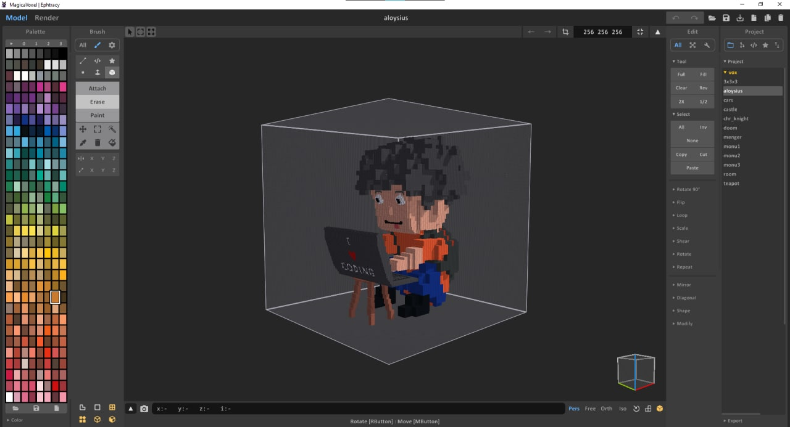
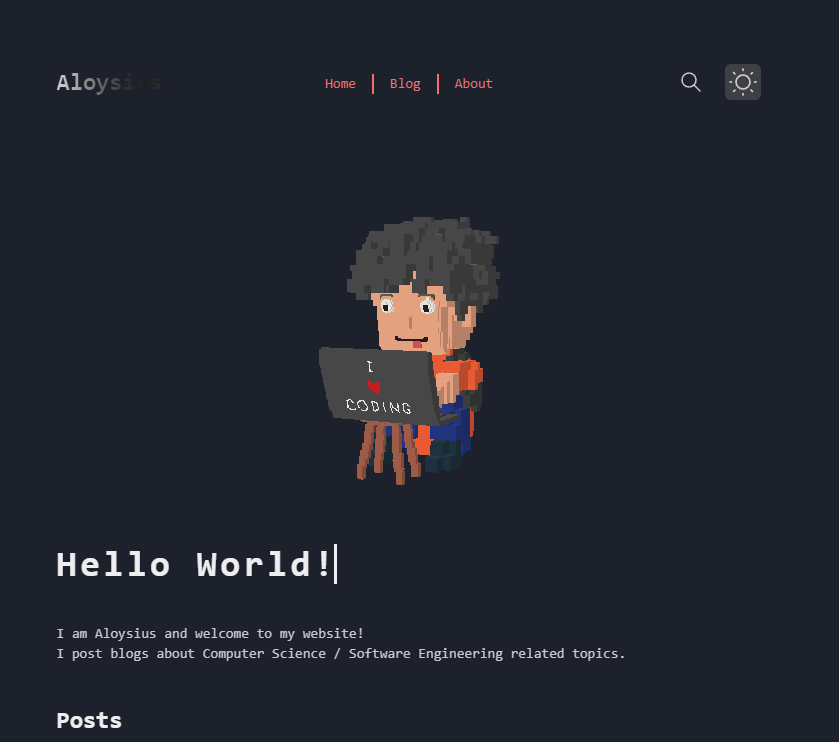

In this blog, I will share how I created my personal voxel art.

# Download MagicaVoxel

In order to create the voxel art, I downloaded a software named ['MagicaVoxel'](https://ephtracy.github.io/)

# Learn how to use MagicaVoxel

Just find any tutorial on YouTube , it's quite simple. I used this [2-minute tutorial](https://www.youtube.com/watch?v=26YyDYgBRuM)

# Voxel Art Progression

I spent a few hours creating the voxel art. This is how I progressed.

After much planning and effort , I completed the voxel art!

# Rendering the voxel art into my website

Using documentation from [ThreeJS](https://threejs.org/) ,
I managed to render the voxel art as a 3D model into my website.

> A true artist is not one who is inspired but one who inspires others. —Salvador Dalí
